# Top 30 Amazon Seller Tools Ranked in 2025 (Latest Compilation)

Running a successful Amazon business can feel like juggling a dozen tasks at once. From product research and keyword optimization to inventory management and reviews, **Amazon seller tools** are the secret sauce that help sellers save time, boost profits, and stay competitive. This roundup tackles the core pain points of FBA, wholesale, and arbitrage sellers – showing how the right software can simplify sourcing, automate tricky processes, and turn data into smarter decisions. Get ready to discover **game-changing Amazon tools** that streamline your workflow, cut out guesswork, and supercharge your sales.

## **[Seller Assistant](https://www.sellerassistant.app)**
*All-in-one wholesale & arbitrage toolkit for end-to-end Amazon sourcing.*

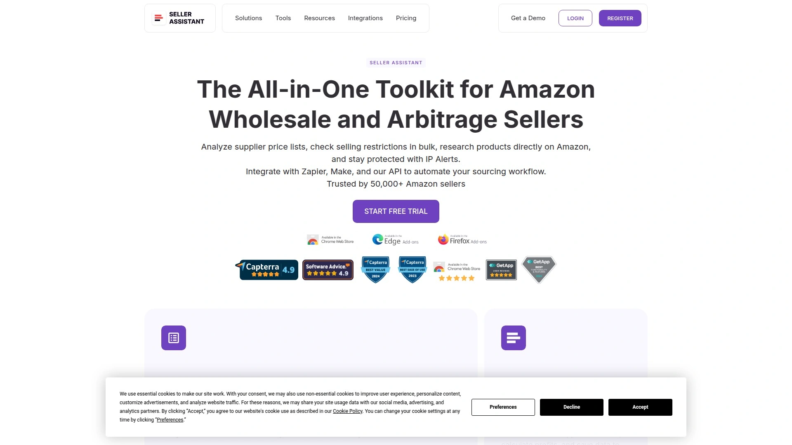

**Seller Assistant** combines over 20 tools to cover every step of selling – **bulk product analysis, restriction checks, profit calculations, and even IP alerts** to avoid risky items. It’s built for **online arbitrage and wholesale sellers**, letting you **analyze supplier price lists in bulk, find profitable products on Amazon, and instantly see ROI and FBA fees** on any listing. With features like a **browser extension, competitor sales tracking (“Seller Spy”), and an integrated VPN for sourcing**, it automates what used to be endless spreadsheets. The learning curve is gentle: you can upload a wholesale catalog or scan an Amazon page and get actionable insights in seconds. By centralizing workflow (from **filtering deals to creating purchase orders**), Seller Assistant helps small teams and solo sellers **scale up faster with confidence**, making it a top pick for serious sellers who want everything in one place.

## **[Helium 10](https://www.helium10.com)**
*Comprehensive suite for product research, keyword ranking, and listing optimization.*

- **All-in-One Powerhouse:** Helium 10 offers **20+ tools** covering **product research (Black Box), keyword research (Magnet, Cerebro), listing optimization, and analytics** – basically everything an Amazon seller needs under one roof.
- **Data-Driven Decisions:** Sellers get **accurate keyword search volumes, competitor tracking, and profit analytics**, helping identify high-demand, low-competition products and optimize listings for SEO.
- **Scaling and Automation:** It includes a **PPC manager (Adtomic) to automate campaigns**, inventory management alerts, and even fraud protection. From newbies hunting their first product to seven-figure sellers refining PPC, Helium 10 makes scaling on Amazon more systematic and less of a guessing game.

## **[Jungle Scout](https://www.junglescout.com)**
*Popular research toolset to find profitable products and validate demand easily.*

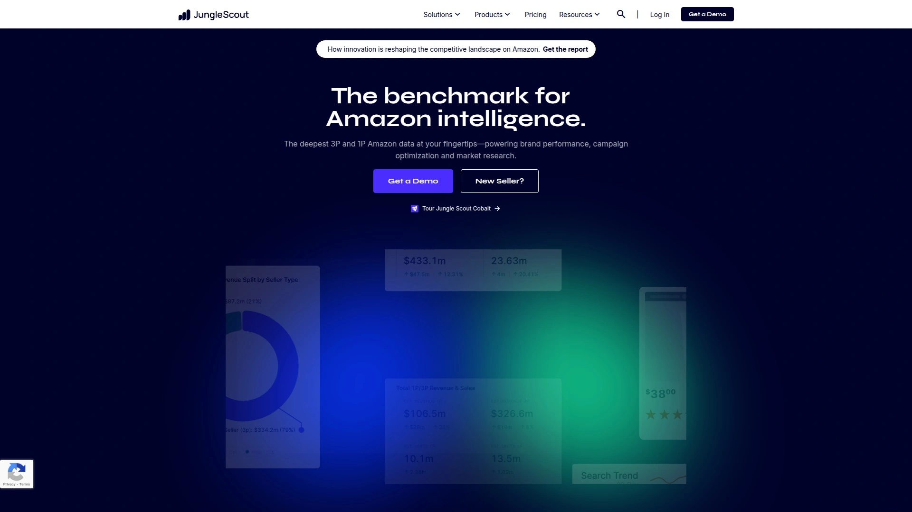

**Jungle Scout** simplifies product hunting for FBA sellers with an extensive **product database and Chrome extension** that reveal sales estimates, revenue, and competition at a glance. It’s beloved by private-label sellers for features like **Opportunity Finder** (to spot trending niches) and a **Supplier Database** to connect with manufacturers. New sellers appreciate the **niche score** and **sales rank tracking** which take the mystery out of which products can succeed. Jungle Scout also offers **inventory forecasting and an email follow-up tool**, so it’s not just research – it helps manage and grow your store. The interface is newbie-friendly, with tutorials guiding you through analyzing demand vs. competition. Overall, Jungle Scout shines at **validating product ideas quickly**, making it a go-to starting tool if you’re aiming to launch a winning product with confidence.

## **[SmartScout](https://www.smartscout.com)**
*Advanced market intelligence for brand analytics and wholesale scouting.*

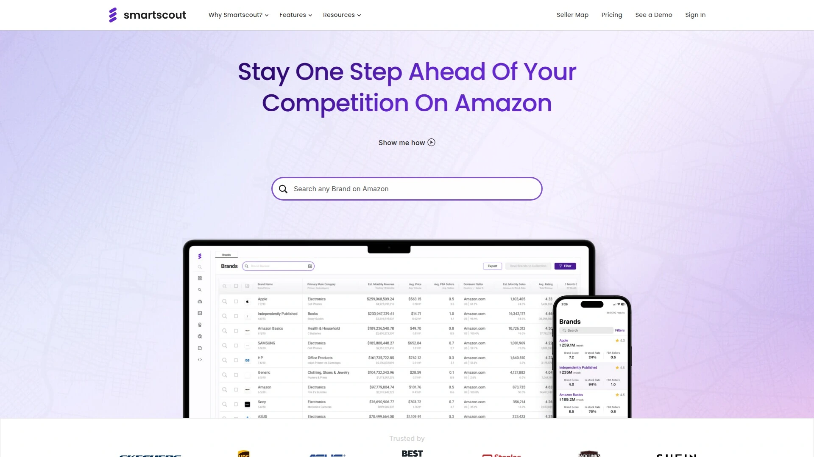

**SmartScout** provides a bird’s-eye view of the Amazon marketplace that’s invaluable for wholesalers and brand-focused sellers. Its standout features include a **brand and category database** – you can pinpoint brands with gaps in distribution or find all sellers of a particular brand. For wholesale, this means **discovering profitable brands that are “reseller-friendly”**. SmartScout’s mapping of sellers is unique: you can literally see who the top sellers are in any category and what products drive their sales. It also offers a powerful **ad spy tool** to analyze competitors’ PPC campaigns and a **traffic graph** to see frequently bought together items. The UI packs a lot of data but is logically organized with filters and visualizations. If you’re scaling up and need **deep analytics (market share, brand revenue, competitor insights)**, SmartScout acts like an Amazon FBI – turning raw data into strategic opportunities.

## **[AMZScout](https://amzscout.net)**
*User-friendly toolkit for product research and sales estimation on a budget.*

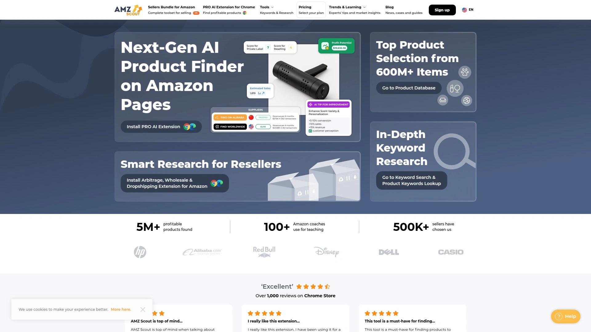

**AMZScout** is known for its handy **Pro Extension**, which overlays key metrics (like monthly sales, revenue, reviews) onto Amazon search results to help you spot lucrative products in real time. It’s a fantastic starter tool – providing a product database, keyword research, and even an FBA calculator without overwhelming new sellers. The **Product Tracker** lets you monitor items over time to gauge consistency in sales and price. AMZScout also suggests **trending products and niches** each week, sparking ideas for your next private label venture or resale item. While not as expansive as some larger suites, AMZScout covers the essentials with a simpler interface and affordable pricing. It’s ideal for sellers testing the waters who want **accurate sales estimates and niche validation** without a steep learning curve or big investment up front.

## **[Viral Launch](https://viral-launch.com)**
*Full-service product launch platform with research, listing optimization, and rank tracking.*

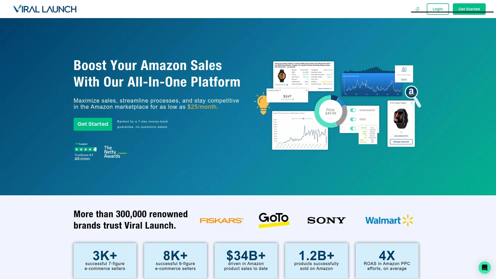

- **Product Discovery & Validation:** Viral Launch’s tools help sellers **find product ideas (Product Discovery), analyze market demand and competition (Market Intelligence), and track keyword rankings** to validate an opportunity before investing.
- **Listing Optimization:** It includes a **Listing Builder and Listing Analyzer**, guiding you to create SEO-rich listings with high-converting images and copy. The software scores your listing quality and suggests improvements so you can outrank competitors.
- **Launch and Analytics:** Famous for its launch support, Viral Launch offers a **keyword rank tracker** and **competitor monitoring**, alerting you to changes in rivals’ prices or reviews. It even has a PPC automation tool (Kinetic) for optimizing ad bids.
*Why use it?* If you’re focused on private label products, Viral Launch provides a soup-to-nuts solution – from uncovering that golden product to ensuring your listing and advertising push it to page one.

## **[Sellics](https://sellics.com)**
*Advertising optimization and profit dashboard combined in one platform.*

**Sellics** (now part of Perpetua) is a veteran tool that offers an integrated approach to selling. Its **Profit Dashboard** gives you real-time visibility into earnings by accounting for all fees, PPC spend, and promotions – so you always know your true margins. On the advertising side, Sellics’ **AI-powered PPC optimizer** automates bid adjustments and keyword harvesting across your campaigns, aiming to boost ad performance while lowering ACoS. For day-to-day operations, it also provides **rank tracking, review management, and inventory alerts** to stay on top of critical metrics. The interface is professional and data-rich, making it popular with more established sellers and agencies. In short, Sellics acts like a command center for your Amazon business, where you can **monitor profits, streamline ads, and manage reputation** without hopping between separate tools.

## **[InventoryLab](https://inventorylab.com)**
*Streamlined listing, inventory management, and accounting for FBA sellers.*

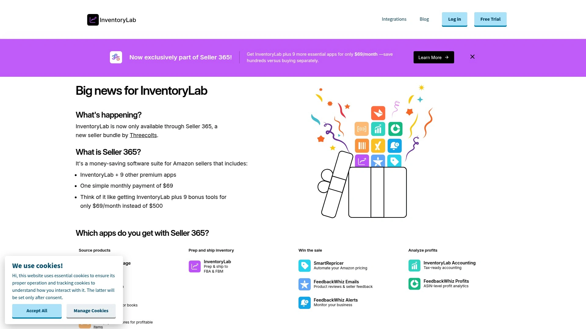

- **Easy Listing & Labeling:** InventoryLab’s **Stratify** software simplifies the process of creating FBA shipments. You can list new products, print Amazon-compliant barcode labels, and prep shipments all in one workflow – a lifesaver for retail arbitrage and wholesale sellers dealing with many SKUs.
- **Profit Tracking:** It automatically tracks your **buy costs, sales, Amazon fees, and ROI** for each item. The **Accounting reports** break down profit by ASIN, by timeframe, and even per shipment, so you know exactly how your business is performing and where the money is going.
- **Scoutify Mobile App:** For sourcing on the go, the **Scoutify 2 app** lets you scan product barcodes in stores to see profitability (after fees), sales rank, and more. You can make quick buy decisions and create purchase batches that sync with your InventoryLab account.
*Bottom line:* InventoryLab is built to **save time and reduce errors in the FBA workflow**, merging the grunt work of listing and bookkeeping into one efficient system.

## **[SellerApp](https://www.sellerapp.com)**
*AI-driven analytics platform for boosting Amazon SEO, PPC, and conversion rates.*

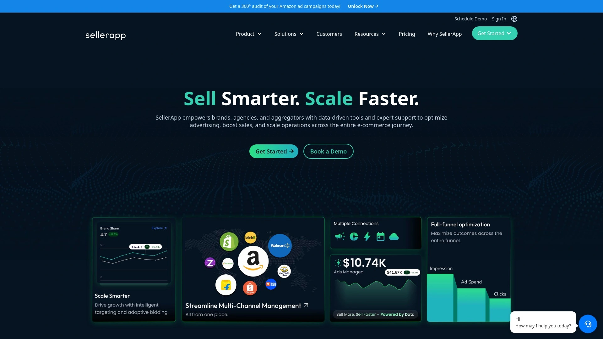

**SellerApp** stands out by using machine learning to help sellers **optimize keywords, automate PPC bids, and analyze product trends**. The dashboard gives a holistic view of your business health – from keyword indexing status to detailed PPC reports – highlighting where you can improve. Its **Product Research** tool also provides smart insights like opportunity score and margin estimates for new product ideas. One highlight is the **Advertising Automation**, which can adjust your Amazon ad bids and budgets based on performance goals you set (like lowering ACoS or scaling profitable campaigns). SellerApp’s **Listing Quality checker** ensures your listings follow best practices and are fully optimized with relevant keywords. It even caters to global sellers with support for multiple marketplaces. If you want a data-centric approach to selling, SellerApp acts as a virtual analytics team to **find growth opportunities, cut wasted ad spend, and improve organic visibility.**

## **[sellerboard](https://sellerboard.com)**
*Real-time profit analytics and expense tracker with alerts for FBA sellers.*

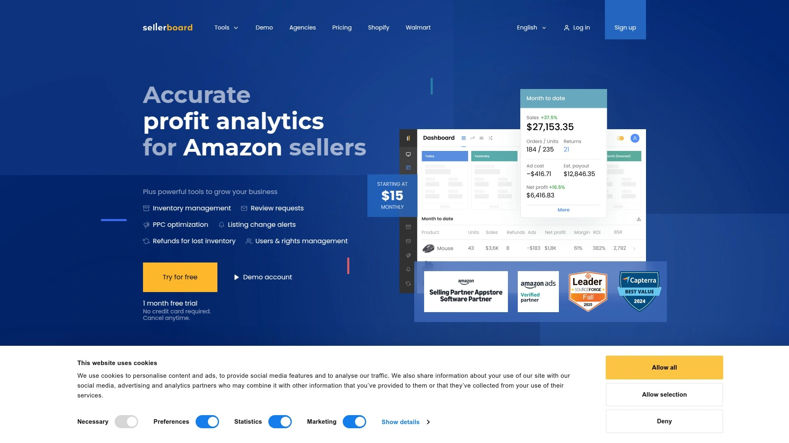

**sellerboard** is all about the bottom line – it crunches your Amazon data to show true **profit after all costs**. It automatically accounts for Amazon fees, advertising spend, returns, storage fees, and even long-term costs like PPC and tool subscriptions (which you can input), giving you a live **profit & loss dashboard**. Many sellers love the **restock and inventory forecasts**, which prevent stockouts by suggesting reorder quantities and dates based on sales velocity. sellerboard also has an **expenses and cashflow module** to track other business expenses and see monthly cashflow at a glance. Additional perks include **automated email follow-ups for feedback/reviews** and **trigger alerts** (for things like unexpected fee changes or hijacked listings). The interface is straightforward and customizable. For any seller tired of complex spreadsheets, sellerboard provides **clarity on your finances** in one refreshingly simple view – so you always know where your money is going and how to improve your margins.

## **[Teikametrics](https://www.teikametrics.com)**
*AI-powered advertising optimizer to maximize Amazon PPC performance.*

**Teikametrics** (also known for its “Flywheel” platform) leverages big data and machine learning to help brands and sellers **automate their Amazon (and Walmart) advertising campaigns**. You set targets (like desired ACoS or total budget), and Teikametrics’ algorithms will adjust bids, pause poor performers, and funnel budget to winning keywords/products continuously. It’s like having a dedicated PPC manager working 24/7, making granular changes that would be impossible to do manually at scale. The tool also provides rich analytics: keyword attribution, search term reports, and profitability insights by SKU, so you can see ad spend vs. sales clearly. For larger sellers, Teikametrics offers marketplace intelligence features – monitoring competitors and category trends to spot new opportunities. While it focuses heavily on advertising, that’s arguably where a lot of profit is won or lost on Amazon. By **removing the guesswork in PPC and leveraging AI to find optimal bids**, Teikametrics helps sellers increase sales volume and ROI without needing to babysit campaigns.

## **[ManageByStats](https://managebystats.com)**
*All-in-one seller software suite for analytics, inventory, CRM, and more.*

- **Central Dashboard:** ManageByStats provides a unified dashboard to view **sales trends, ASIN performance, customer metrics, and profit**. It consolidates data from Seller Central in a far more digestible way, highlighting KPIs like repeat customer rate and lifetime value.
- **Customer Management:** It acts as a mini-CRM for Amazon. You can see customer purchase histories, automate follow-up emails, and even tag customers (e.g., big spenders, repeat buyers) for targeted marketing outside Amazon.
- **Inventory & Ads:** The tool includes **inventory tracking with forecasting**, so you know when to reorder, and it integrates an **Amazon PPC manager** to monitor and adjust campaigns. There’s also a keyword rank tracker and listing optimization suggestions.
- **Bonus Tools:** ManageByStats has extras like **review alerts**, a **CSV export tool** for all your data, and even a **KDP module** if you publish books. It’s extremely comprehensive.
*In essence*, ManageByStats lets you **run your Amazon business from one interface**, with control over operations, analytics, and customer relations – great for sellers who want granular control without cobbling together many single-purpose apps.

## **[Tactical Arbitrage](https://tacticalarbitrage.com)**
*Premier sourcing software for online and wholesale arbitrage, scanning thousands of sites.*

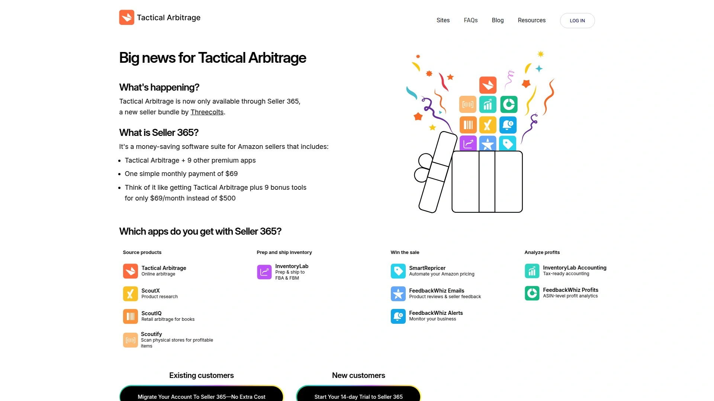

**Tactical Arbitrage** is the go-to tool for arbitrage sellers hunting profitable flips. You can input a retailer’s website or a wholesale supplier list, set your filters (ROI%, sales rank, etc.), and TA will **scan through massive product catalogs** to identify items that are cheaper in the store than on Amazon (after fees). It supports **hundreds of retail sites** (Walmart, Target, Home Depot, etc.) and has a library of wholesale spreadsheets you can upload. The results show potential profit, whether you’re eligible to sell the item, and even include a **Keepa chart** view for price history. It’s like having a virtual army of shoppers comparing prices for you at lightning speed. TA also added an **image matching feature** to find Amazon listings that might not match by UPC. While the interface has many options (it can be daunting at first), the power is unparalleled for **finding arbitrage deals**. Simply put, Tactical Arbitrage turns hours of product scouting into an automated task – so you can spend your time buying and selling, not searching.

## **[SellerAmp](https://selleramp.com)**
*Rapid deal analysis tool for arbitrage sellers, with mobile and web app integration.*

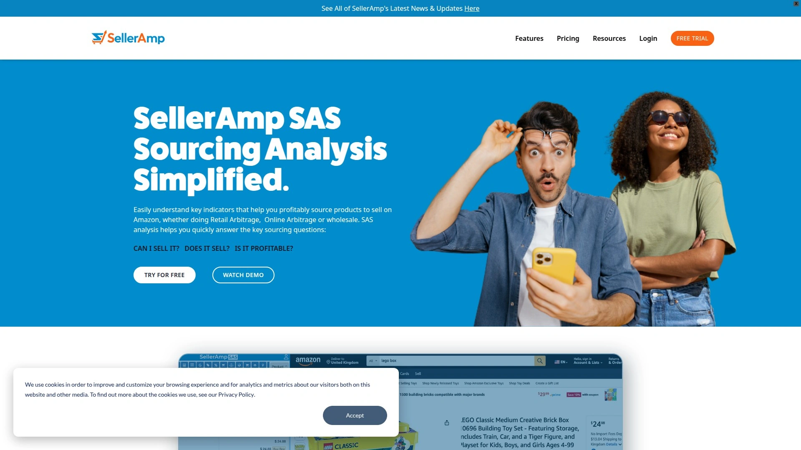

**SellerAmp (SAS)** is a favorite among online and retail arbitragers who need to **make quick decisions on products**. With its Chrome extension (and a mobile app), you can analyze any Amazon product page in seconds – seeing **profit after fees, ROI, sales estimates, competitor stock levels, and if you’re gated or not** for that item. It basically combines an FBA calculator, sales rank tracker, and restriction checker in one compact view. SellerAmp also lets you **export buys to Google Sheets**, making it easy to create a shopping list or track purchases. There’s a handy feature for **product sourcing:** you can input a store URL and it will try to match those products to Amazon listings. New sellers appreciate the simplicity – no need to copy ASINs into multiple tools, SellerAmp surfaces the key metrics right on the product page or via a barcode scan in-store. Bottom line: it’s a **huge time-saver for arbitrage**, allowing you to cherry-pick the best deals with confidence and skip the duds immediately.

## **[ZonGuru](https://www.zonguru.com)**
*All-in-one FBA tool suite with a focus on private label product research and tracking.*
- **Niche & Keyword Tools:** ZonGuru helps identify profitable product niches through its **Niche Finder and Sales Spy**, which gauge demand vs. competition for product ideas. The **Keyword Research (Keyword Tool & Keyword Spotlight)** reveals high-volume search terms to target, and even suggests relevant long-tails you might miss.
- **Listing and Review Management:** With the **Listing Optimizer**, sellers can draft and score listings, ensuring top keywords are included for maximum SEO impact. ZonGuru also monitors your listings and alerts you to any changes or new negative reviews, acting like a watchdog for your brand.
- **Business Metrics:** It offers dashboards for **profit tracking, inventory alerts, and email automation** to request reviews. The **IP Monitor** will even warn if someone hijacks your listing or if your product goes out of stock.
- **Integrated Approach:** Because ZonGuru modules talk to each other, you can easily go from finding a product idea to tracking its keyword ranking and managing its reviews all in one platform. It’s a solid choice for private label sellers aiming to **scale efficiently while keeping an eye on all critical metrics.**

## **[ZonBase](https://www.zonbase.com)**
*Amazon growth platform combining product research, listing tools, and mentorship resources.*

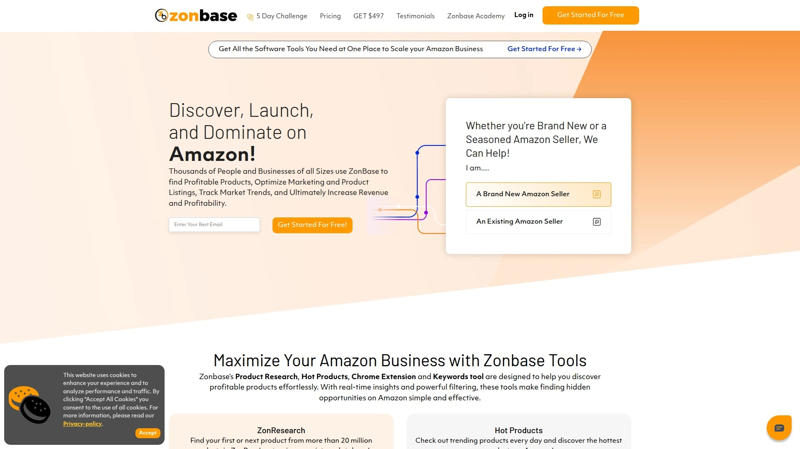

**ZonBase** packs in a variety of seller tools: a **Product Database and ZonResearch** for finding promising products, a **Chrome extension (ZonBase Researcher)** for quick on-page analysis, and a **Keywords tool (ZonBase Keyword) for SEO** insights. One notable feature is its **Sales Estimator**, which can project sales for a given niche or ASIN to help validate demand. ZonBase also offers **listing optimization help**, including a photo enhancer and listing analyzer to maximize your conversion rates. Beyond software, ZonBase is known for providing access to experts and coaching (through ZonBase University and mentorship programs), which can be helpful if you want guidance on using the tools or general FBA strategy. For those on a budget, they also frequently offer lifetime deals or bundle discounts. In short, ZonBase aims to be a **one-stop shop for new Amazon sellers** – giving you the research data, optimization tools, and even training to launch and scale a product successfully.

## **[IO Scout](https://ioscout.io)**
*Affordable alternative to major suites, offering core Amazon research and tracking tools.*

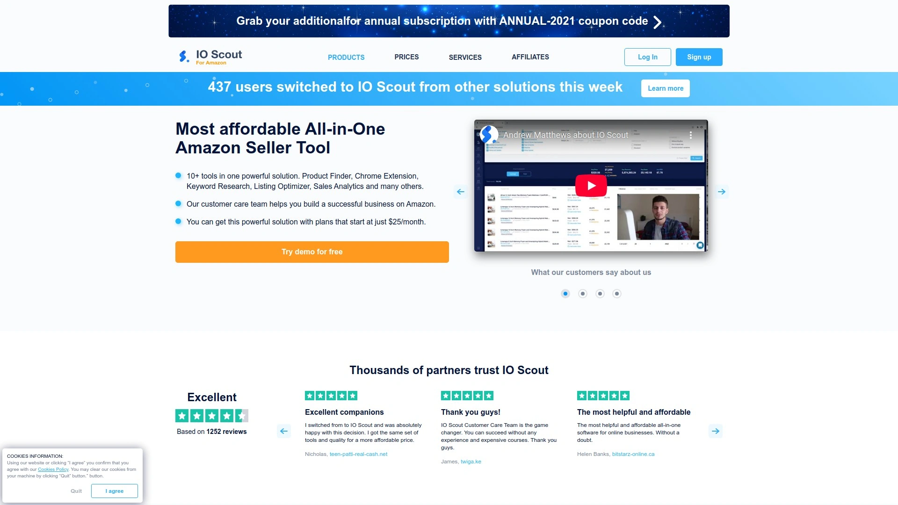

**IO Scout** delivers many of the key functions sellers need without the big price tag. Its **Product Finder** lets you sift through millions of Amazon products using criteria like sales, rank, price, reviews, etc., to spot undervalued opportunities. There’s also a **Browser Extension** similar to others, showing real-time metrics (estimated sales, revenue, FBA fees) when you browse Amazon. IO Scout includes a **Keyword Research and Tracking** module to optimize your listings and monitor their search rank over time. Users often praise the clean, straightforward interface – it’s easy to navigate and understand, even if you’re not a tech wizard. Another plus: IO Scout offers a **one-time purchase Lifetime plan** occasionally, which can be a steal for long-term use. While it may not have every bell and whistle, IO Scout covers product research, keyword analysis, and even has basic **inventory and sales tracking dashboards**. It’s a solid pick for sellers who want **reliable data insights similar to bigger names, but with a simpler UI and friendlier pricing.**

## **[ProfitGuru](https://www.profitguru.com)**
*AI-enhanced product research tool with a free starter plan for new sellers.*

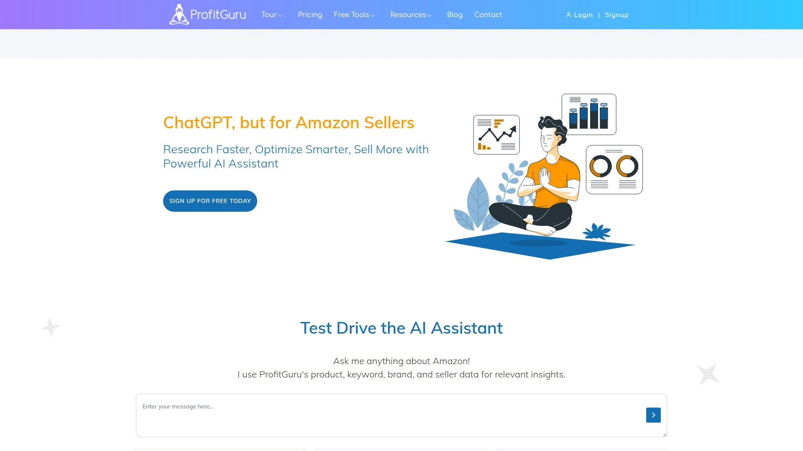

**ProfitGuru** is a newer entrant making waves by offering a lot of value upfront. It helps Amazon sellers find product opportunities by allowing searches for **“undervalued” listings – products with high demand but poor listings (low reviews, bad photos)** which you could potentially improve upon. The platform is **AI-powered**, meaning it can surface interesting patterns or suggestions (for example, which niches are trending or which products could benefit from bundling). ProfitGuru also has a **Chrome extension** for on-page analysis and a **Profit Calculator** to quickly check FBA fees and margins. One standout is that many of its features are **free to use**, with premium options for deeper dives, making it very attractive for those just starting out. The interface emphasizes simplicity: you get clear metrics like sales estimates, competition score, and even recommendations for related products to research further. For sellers looking for a **cost-effective way to leverage data and AI in product hunting**, ProfitGuru is definitely a tool to try.

## **[SellerSprite](https://www.sellersprite.com)**
*Powerful keyword and market research toolbox, popular among global Amazon sellers.*

- **Keyword Intelligence:** SellerSprite excels at keyword research with tools for **finding high-traffic keywords, long-tail suggestions, and backend search terms**. It even supports multiple marketplaces (US, EU, Asia) with localized data, which is great if you sell internationally.
- **Product & Niche Research:** The platform provides market analysis features to uncover new product ideas and track competitor performance. You can see **top sellers in a category, estimate sales/revenue**, and monitor how a competitor’s rank or price changes over time.
- **PPC and Ranking:** SellerSprite’s **PPC optimization tool** analyzes your ad campaigns and suggests keyword bids and negative keywords to improve efficiency. Meanwhile, a **rank tracker** keeps tabs on your organic positions and lets you know how listing changes affect SEO.
- **Unique Insights:** One unique feature is **Storefront Analysis** – you can analyze any Amazon storefront to see all the products they sell and their estimated sales, which can reveal a competitor’s strategy or a wholesaler’s catalog.
Overall, SellerSprite is like a Swiss army knife for data-hungry sellers, especially those focusing on keywords and cross-marketplace opportunities to gain an edge.

## **[BQool](https://www.bqool.com)**
*AI-driven repricer and feedback management solution to keep you competitive.*

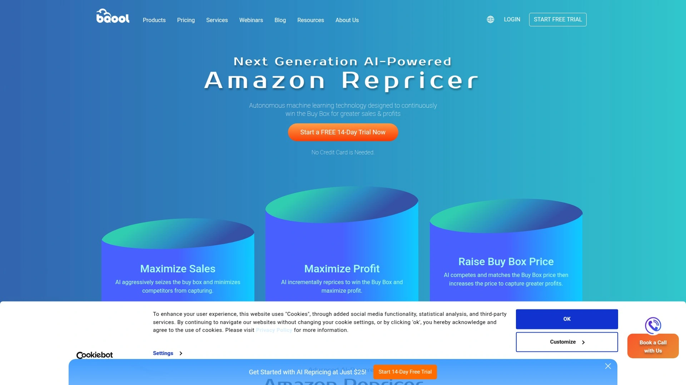

**BQool** is best known for its **Repricing Central**, an automated repricer that helps win the Buy Box by adjusting your prices 24/7 within rules you set. It’s smart – you can choose algorithms that, for example, aggressively lower price to capture the Buy Box then raise it to maximize profit once you’re the only seller. This is crucial for wholesale or resellers competing on listings with other sellers. BQool also offers a **Feedback Central** module: it automates the process of requesting seller feedback and product reviews via Amazon-compliant emails, and it alerts you to negative feedback so you can address it promptly (and maybe get it removed or revised). Additionally, there’s a **Review Central** for tracking product reviews on your ASINs, helping you gauge customer sentiment and respond to issues. The interface ties all these together, so you effectively manage **pricing, reputation, and customer communication** in one. For multichannel sellers, BQool supports some integrations outside Amazon as well. In short, BQool helps you **stay competitive on price without constant manual checks**, while also boosting your seller reputation and reviews on autopilot.

## **[SellerActive](https://www.selleractive.com)**
*Multi-channel inventory and order management with dynamic repricing.*

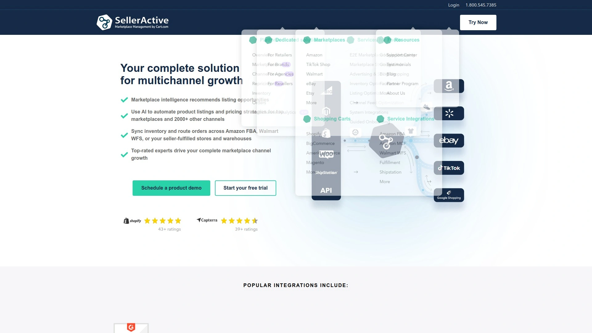

**SellerActive** is a robust platform for those expanding beyond Amazon (think eBay, Walmart, Shopify, etc.) and needing to keep everything in sync. Its core strength is **inventory management** – it will automatically adjust your inventory across all channels when a sale is made on any one platform, preventing overselling. It also simplifies order fulfillment by aggregating orders from all marketplaces into one interface and can even route them to FBA (Multi-Channel Fulfillment) or other 3PLs. For Amazon in particular, SellerActive includes a **repricing tool** that helps stay competitive in the Buy Box, similar to dedicated repricers, with customizable strategies (e.g., beat the competitor by $0.01 until hitting your min price). Another perk is the **analytics dashboard** which gives a consolidated view of sales across channels, so you can compare performance. SellerActive’s system is cloud-based and designed to handle large catalogs, making it popular with high-volume sellers and businesses that sell kits/bundles. If you’re managing an **omni-channel e-commerce operation**, SellerActive can be a lifesaver – automating the tedious parts of inventory and order control so you can focus on growth.

## **[HelloProfit](https://helloprofit.com)**
*Real-time Amazon analytics and PPC management for profit-focused sellers.*

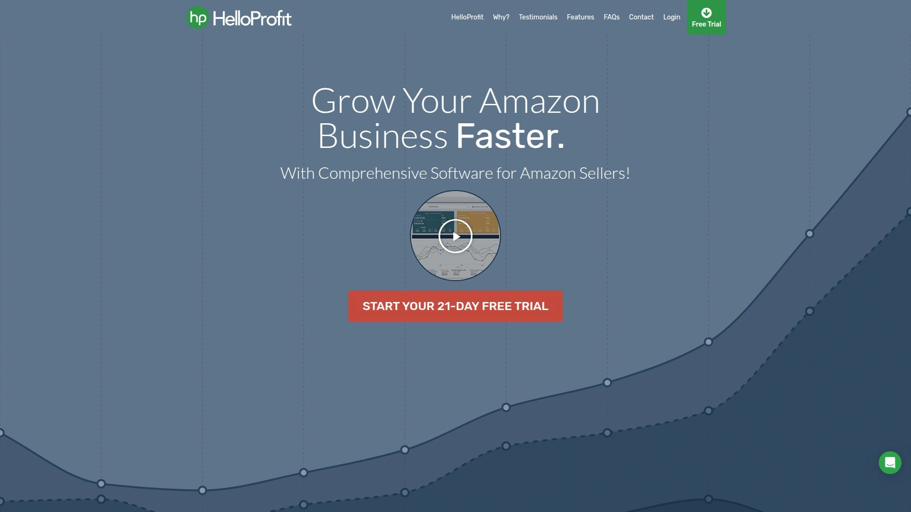

- **Instant Profit Overview:** HelloProfit lives up to its name by giving a **live dashboard of your profits** across all SKUs and marketplaces. The moment you log in, you see today’s sales, profit after costs, and even which SKUs are your top earners (or losers). It’s very granular – you can drill down to per-unit profit on each ASIN and identify where fees or ad spend might be eating your margin.
- **PPC and Keyword Tracking:** The tool has integrated **PPC management**, showing ACoS and spend per ASIN alongside organic sales. This helps sellers quickly gauge if their ad campaigns are effective. You can adjust bids or toggle campaigns on/off right from the HelloProfit interface, which is convenient.
- **Customer & Order Insights:** HelloProfit also provides detailed customer order data, so you can see repeat purchase behavior or identify your VIP customers. It even allows setting up **custom alerts** (for example, if a product’s profit drops below a threshold or if an ASIN gets a negative review).
- **Ease of Use:** The interface is colorful and intuitive, using charts and tables that update in near real-time. It’s a favorite of those who love metrics and want to react quickly to trends.
*Summing up:* HelloProfit is like a real-time profit and ads co-pilot – if you want to stay on top of every dollar earned or spent on Amazon daily, this tool puts the info at your fingertips with no delay.

## **[OAGenius](https://www.oagenius.com)**
*Automation software for Amazon dropshipping and arbitrage operations.*

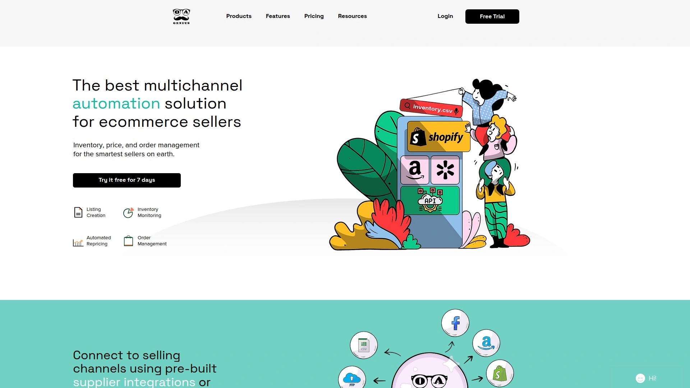

**OAGenius** caters to the dropshippers and arbitrage sellers who source from retail websites or suppliers and fulfill orders directly to customers. Its flagship feature, **Sage**, automatically monitors your supplier sources (like Walmart, Home Depot, etc.) for **price changes and stock availability** – if your source goes out of stock or raises their price, OAGenius can pause your Amazon listing or adjust the price to protect your margins. It also has a **rapid listing creation tool**: you can list items on Amazon in bulk using source URLs or UPCs, and OAGenius will pull in product details and images for you. For order fulfillment, OAGenius aggregates your orders and can even automate placing orders on the supplier’s site (using techniques like browser automation) – effectively acting as a virtual assistant to fulfill each dropship order. It integrates with Amazon to **upload tracking numbers** once orders are shipped, keeping your account health in check. Additionally, sellers get a dashboard of profit calculations factoring in item costs, shipping, and taxes. In short, OAGenius addresses the unique pain points of **retail arbitrage and dropshipping** by automating the tedious tracking and fulfillment tasks, so sellers can scale these models with far less manual work.

## **[AsinZen (AZInsight)](https://www.asinzen.com)**
*On-page Chrome extension for quick FBA calculations and competitor insights.*

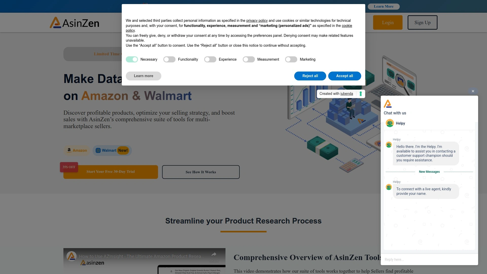

- **Instant FBA Analysis:** AZInsight by AsinZen is an extension that overlays crucial data when you view a product on Amazon. It instantly shows **profit calculations (net after FBA fees), ROI%, and break-even price** so you know if a deal is viable without leaving the page.
- **Restriction & IP Check:** It has built-in features to **check if you are gated (restricted)** from selling a particular brand or category on your account and warns of any known **IP complaint risks** for that brand – helping arbitragers avoid troublesome products.
- **Stock and Seller Info:** AZInsight can reveal how many units other sellers have in stock (handy to gauge competition) and provides a summary of all competitive offers (FBA vs FBM, seller ratings, etc.). You basically get a mini **competitor analysis** right on the listing.
- **Data Export & Scouting:** For bulk analysis, AsinZen allows **exporting data to spreadsheets** or integrating with Google Sheets, making it easier to analyze wholesale lists or catalog results. There’s also a ScanEZ mobile app that ties into the system for retail arbitrage scanning.
*This tool is beloved by arbitrage and wholesale hunters* because it condenses what would be 5 different checks into one view. With AZInsight, you can **scan through leads at high speed**, confident that you’re seeing the full picture (fees, eligibility, competition) instantly.

## **[ScanUnlimited](https://www.scanunlimited.com)**
*Bulk wholesale list scanner for finding profitable products from supplier catalogs.*

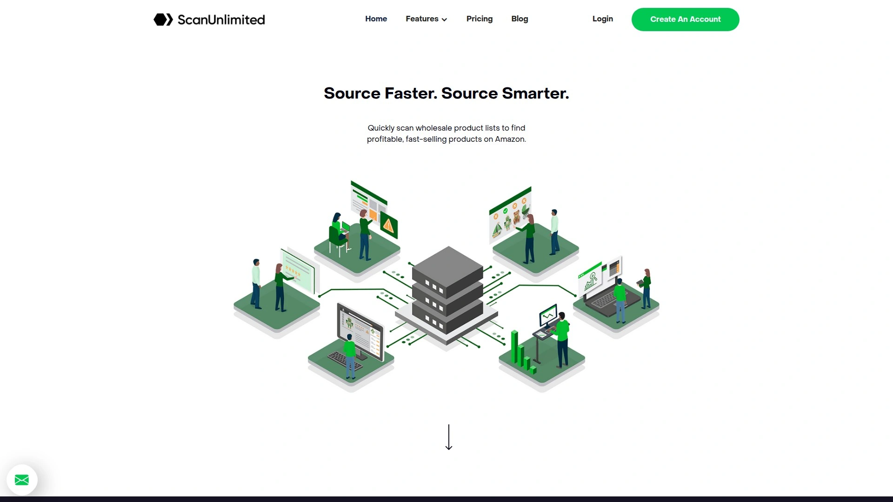

**ScanUnlimited** is a must-have if you deal with long price lists from distributors. Instead of manually checking each item, you upload an Excel or CSV of your supplier’s products (UPC, SKU, or product names with prices) and the tool will **automatically match them to Amazon listings and show potential profit, sales rank, and ROI for each**. This turns hours of tedious work into a few minutes. It provides filters so you can quickly narrow down to, say, items with at least 30% ROI and under 100k sales rank, etc. The data is presented in a clean table where you can sort and cherry-pick the best opportunities. ScanUnlimited also flags if you’re **restricted** on any ASIN and can exclude those. Another neat feature is the **bulk 2-step listing creation** – after identifying products, you can directly create a purchase order or upload feeds to Amazon (via connected services). The software continuously updates its product database, which means it’s pretty good at matching even if the supplier’s info is sparse. For Amazon wholesalers, ScanUnlimited massively **increases efficiency in product scouting**, allowing you to leverage big catalogs without drowning in manual lookups.

## **[Sellzone (by Semrush)](https://www.sellzone.com)**
*Toolkit for listing optimization, split testing, and traffic analysis to boost conversions.*

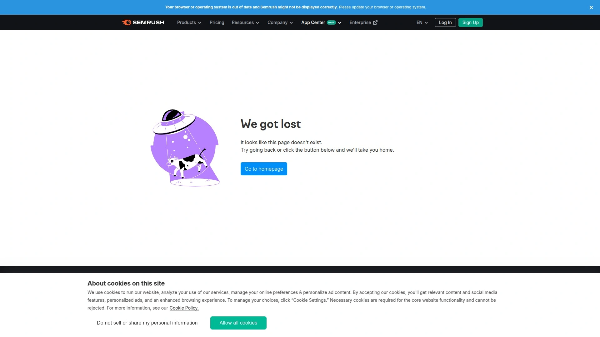
  
**Sellzone**, backed by the Semrush team, focuses on helping sellers **optimize their Amazon product listings and external traffic**. It offers a **Listing Quality Check** that audits your listings for issues (like missing keywords, low-res images, or content violations) and provides suggestions to improve visibility and conversion. One standout feature is **Split Testing**: Sellzone allows you to A/B test different elements of your listing – titles, images, descriptions – and it will automatically rotate them and track which version yields better sales or conversion rate. This takes the guesswork out of deciding, say, which main image best attracts buyers. Additionally, Sellzone’s **Traffic Insights** tool shows how your Amazon listing is receiving external traffic. It can analyze sources like Google, Facebook, and Pinterest to reveal new avenues to promote your product (super useful for those doing their own marketing). The **Keyword Wizard** helps you discover high-impact keywords to add to your listing or PPC campaigns, leveraging Semrush’s vast data. Overall, Sellzone is all about **maximizing your listing’s performance** – more views and higher conversion – by using data-driven tweaks and tests, something every serious seller can appreciate in a competitive marketplace.

## **[SellerChamp](https://sellerchamp.com)**
*Bulk product lister and inventory sync tool for high-volume sellers and resellers.*

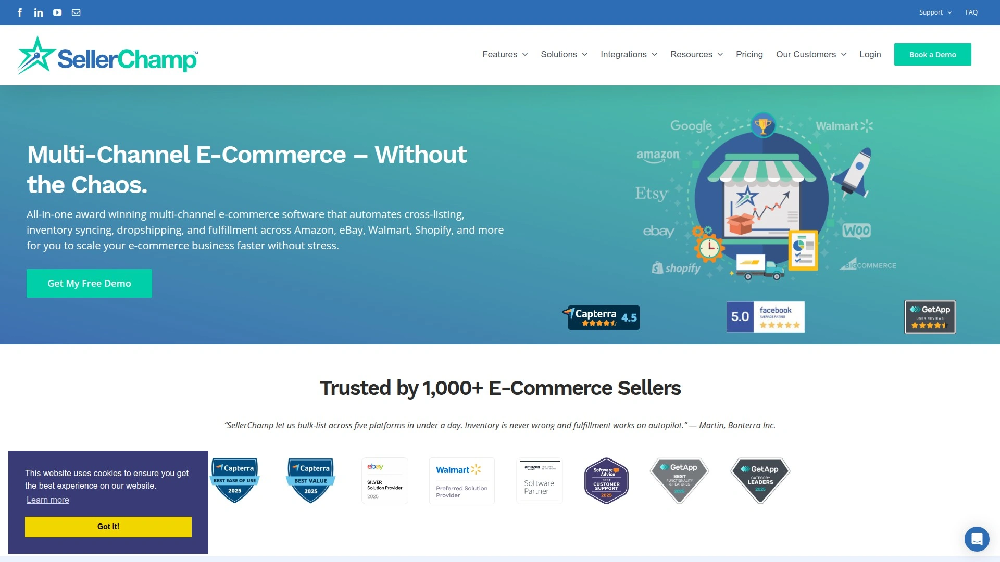

**SellerChamp** streamlines the process of listing and selling large quantities of products across Amazon, eBay, and other platforms. If you have a ton of SKUs (like a reseller, book seller, or liquidation business), you can **upload a spreadsheet or scan barcodes in bulk** using their app, and SellerChamp will create all the Amazon listings for you in one go – complete with inventory quantities, condition notes, etc. It supports FBA and FBM listing flows, including printing FBA labels and shipping labels. The tool also automates repetitive updates: for example, if you need to adjust prices or quantities on dozens of listings, you can do it in a single dashboard and push changes out to Amazon (and other linked marketplaces) instantly. SellerChamp includes an **order management system**, so FBM sellers can print pick lists and packing slips easily each day. Plus, it can send tracking info back to Amazon or customer emails as orders are fulfilled. Another benefit is **cross-posting**: list an item on Amazon and eBay at the same time and keep inventory synced – when it sells on one, the other updates. By taking the tedium out of bulk listing and multichannel management, SellerChamp lets sellers focus on sourcing inventory and growing sales, rather than being bogged down by the mechanics of uploading and updating listings.

---

### FAQ: Common Questions

**Q1: How do I know which Amazon seller tool is right for my business?**
**A1:** Start by identifying your biggest pain point. If you struggle with **product research**, a tool like Jungle Scout or Helium 10 is ideal. For **wholesale and arbitrage sourcing**, consider Seller Assistant or Tactical Arbitrage. Those focused on **ads** might lean toward Teikametrics. Many tools offer free trials, so test a few and see which interface and insights you find most actionable.

**Q2: Do these tools support international Amazon marketplaces?**
**A2:** Yes – most major suites (Helium 10, SellerApp, Sellics, etc.) support multiple marketplaces like **US, EU, UK, and more**. Be sure to check each tool’s coverage. For example, SellerSprite and Helium 10 allow you to switch between marketplace databases for research, and ManageByStats or sellerboard can aggregate profit data across regions. Always verify that the marketplaces you sell in are included before subscribing.

**Q3: Can these Amazon seller tools help improve my product rankings?**
**A3:** Absolutely. Tools focused on **SEO and listing optimization** (like Sellzone, Helium 10’s Scribbles, or SellerApp) will help you fine-tune your keywords and content which boosts organic rank. Others improve rank indirectly – for instance, **feedback tools (FeedbackWhiz, SageMailer)** help generate positive reviews, which can improve ranking and conversion. PPC optimizers (Teikametrics, Sellics) drive more sales through ads, which also can lift organic ranking over time. Using the right combination will enhance both visibility and sales velocity.

---

In conclusion, the right mix of tools can transform how effectively you run your Amazon business. Whether you need to uncover profitable products, automate pricing, or streamline inventory, there’s a solution above that fits the bill. Remember, success on Amazon often comes down to working smarter, not harder – and these tools are all about smart shortcuts and data-driven decisions. If you’re serious about scaling up, start with **[Seller Assistant](https://www.sellerassistant.app)** for an end-to-end arbitrage and wholesale solution that ties everything together, and add on others that meet your specific needs. By equipping yourself with the best tools in the industry, you’ll free up time, reduce guesswork, and put your Amazon growth into high gear. Happy selling!
